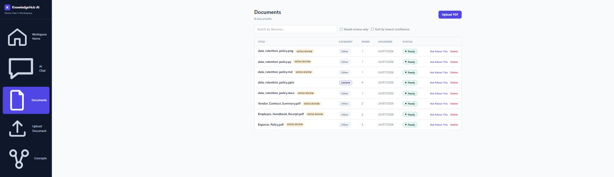
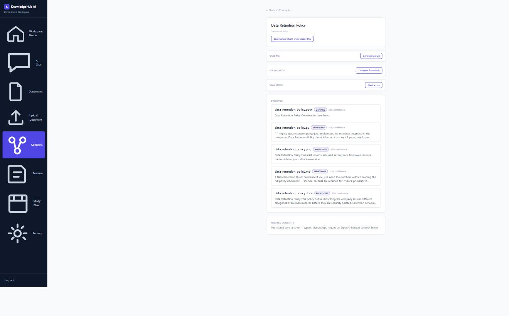
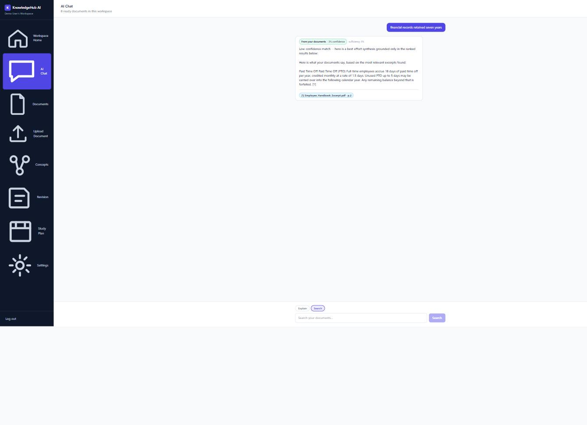
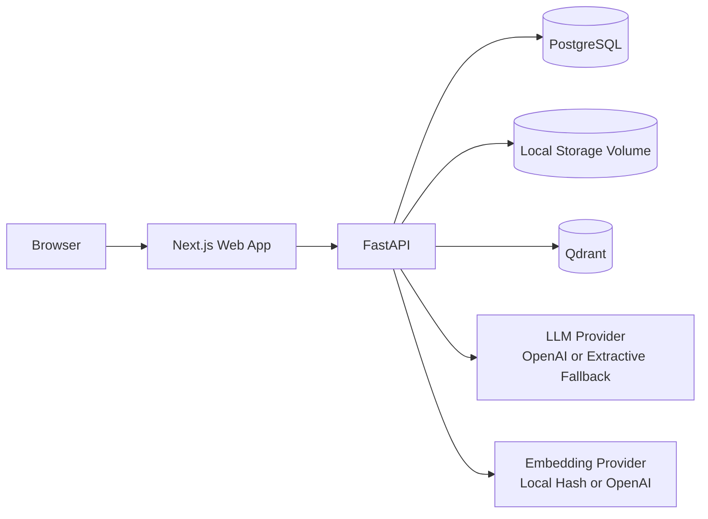

# KnowledgeHub AI

**Your Organization's Intelligence, Instantly Searchable.**

[](https://github.com/Saivk25/KnowledgeHUB-AI/actions/workflows/ci.yml)
[](https://github.com/Saivk25/KnowledgeHUB-AI/tags)
[](LICENSE)
[](apps/api/requirements.txt)
[](apps/web/package.json)

> **Status: Milestone 11 of 12 -- Confidence & Correction UX -- implemented
> and verified (commit `12e93c0`), to be tagged `v0.11.0`.** Milestones
> 1-11 are implemented, verified, and frozen. This README has two parts:
> **Part 1** describes the finished product this project is building
> toward; **Part 2** describes exactly what exists in this repository
> right now.

## Contents

- [Part 1 -- The Vision](#part-1----the-vision-what-this-becomes-when-complete)
- [Part 2 -- What's Built So Far](#part-2----whats-actually-built-so-far-through-milestone-11)
- [Screenshots](#screenshots)
- [Tech Stack](#tech-stack)
- [Architecture](#architecture)
- [Quickstart](#quickstart)
- [Testing](#testing)
- [Repository Layout](#repository-layout)
- [Roadmap](#roadmap)
- [Contributing](#contributing)
- [License](#license)

---

## Part 1 -- The Vision: What This Becomes When Complete

KnowledgeHub AI is being built against one litmus test: *would someone
actually open it instead of Google Drive, Notion, Obsidian, or ChatGPT?*
Not "does it store files" or "can it answer questions" -- those are table
stakes. The test is whether it becomes the place someone goes first when
they need to think with what they already know.

Three consequences follow from that:

- **The unit of value is a concept understood, not a file stored.**
  Uploading a PDF isn't the point -- extracting what's *in* it, linking it
  to everything else the user already knows, and being able to explain
  it back is the point. The primary landing surface is meant to end up
  being a concept map / concept list ("here's what you know things
  about"), with the document library demoted to a secondary "Evidence"
  view for provenance auditing -- the same relationship Google Drive has
  to a well-organized Notion.
- **The system has to know things about the user, not just about their
  documents.** A personal learning layer tracks what's been exposed,
  self-reported, and tested -- building toward a real mastery signal per
  concept, not just "this file was uploaded once."
- **The system occasionally has to speak first.** Proactive surfacing --
  resurfacing a concept before a quiz, flagging a contradiction between
  two sources -- rather than only ever waiting to be asked.

**When finished, the product does the following:**

- **Ingests almost anything**, not just PDFs: DOCX, PPTX, plain text and
  Markdown, source code files, YouTube transcripts, and OCR'd handwritten
  notes or slide photos -- all through the same extractor/chunker/
  embedding pipeline, each format an additive plugin rather than a
  special case.
- **Classifies and organizes automatically** -- source type, subject, and
  topic suggestions with honest confidence scores, and a manual
  correction flow when the system gets it wrong.
- **Builds a real concept graph**, not just a flat document index --
  concepts and the relationships between them, linked back to the exact
  chunk of evidence that justified each link, so "why does the system
  think X relates to Y" is always answerable.
- **Answers questions from what it actually knows first.** Retrieval is
  local-first: dense vector search plus concept-graph expansion against
  the user's own workspace, with a fail-closed sufficiency scorer
  deciding whether the local evidence is actually enough before ever
  answering. Every answer carries a structural provenance label -- purely
  Local, Local+concept-graph (Hybrid), or External general knowledge --
  and falling outside the user's own documents always requires their
  explicit, revocable consent. Nothing invented is ever presented as if
  it came from the user's own material.
- **Supports real workflows, not just Q&A**: Explain, Compare, Summarize,
  and Search as first-class intents, followed by structured study
  workflows -- Quiz me, Flashcards, Viva mode, Revision mode, a study
  planner -- each with its own contract and prompt template, building on
  proven retrieval rather than bolting study features onto raw chat.
- **Makes capture as important as retrieval.** A universal capture
  surface -- quick notes, pasted text, copied code, screenshots -- reuses
  the same extraction and chunking pipeline documents use, so anything
  captured is immediately part of the same searchable, linkable
  knowledge base.
- **Surfaces its own confidence everywhere**, not just at answer time --
  OCR confidence, classification confidence, retrieval confidence -- each
  with a correction flow that actually feeds back into stored metadata.

Architecturally, the finished system stays deliberately small: Postgres
and Qdrant, not a dedicated graph database, for as long as recursive CTEs
and clean indexing can carry the concept graph; plugin registries for
extraction/classification/chunking instead of growing if/elif chains;
the sufficiency scorer as its own named, independently tested module,
never a magic threshold buried in a retrieval call; and provenance
enforced at the type level, so it's structurally impossible to construct
an answer without one. The full rationale for each of these lives in
[`docs/adr/`](docs/adr/) and in the governing architecture and roadmap
document this repository is built against.

---

## Part 2 -- What's Actually Built So Far (Through Milestone 11)

Everything below is real, implemented, tested, and frozen -- not a plan.

### Milestone-by-milestone

- **M1 -- Project Foundation** (`v0.1.0-foundation`): FastAPI + Next.js
  monorepo, Docker Compose, Postgres, Qdrant, health/readiness checks.
- **M2 -- Authentication & Workspace** (`v0.2.0-authentication`):
  registration, login, logout, session cookies, per-user workspace
  creation and isolation.
- **M3 -- Document Upload & Ingestion** (`v0.3.0-document-ingestion`): PDF
  upload, background extraction (PyMuPDF), page-aware chunking, pluggable
  embeddings, Qdrant indexing scoped per workspace.
- **M4 -- Resource Model** (`v0.4.0-resource-model`): `Document` replaced
  by a polymorphic `Resource` model; schema management moved from
  `create_all` to real Alembic migrations.
- **M5 -- Multi-Format Ingestion** (`v0.5.0-multi-format-ingestion`):
  DOCX, PPTX, TXT/Markdown, code files, YouTube transcripts, and
  image-OCR extractors added via an `Extractor` registry.
- **M6 -- Metadata, Classification & Confidence**
  (`v0.6.0-metadata-classification`): automatic source-type and
  subject/topic classification with stored confidence scores, plus a
  manual-correction workflow.
- **M7 -- Concept Graph** (`v0.7.0-concept-graph`): `concepts` /
  `resource_concepts` / `concept_relationships` schema, incremental
  concept-linking on ingestion, cycle-safe traversal, browse-by-concept
  UI.
- **M8 -- Local-First Retrieval & Provenance**
  (`v0.8.0-local-first-retrieval`):
  - Hybrid retrieval: dense vector search plus one-hop concept-graph
    expansion, merged and deduplicated by real chunk identity.
  - A standalone, independently tested sufficiency scorer
    (`app/services/sufficiency.py`) -- fail-closed by construction, so a
    query with zero relevant local content can never be labeled Local.
  - Structural provenance on every answer (`LOCAL` / `HYBRID` /
    `EXTERNAL`), with workspace-level and per-request consent gates
    before any external model call is ever made.
  - Chat reactivated end-to-end: `/api/v1/conversations` mounted, and
    `apps/web/app/chat/` live with a provenance badge, retrieval
    confidence, and an explicit external-fallback confirmation control.
- **M9 -- Intent Workflows** (`v0.9.0-intent-workflows`):
  - Four distinct intents -- Explain, Search, Summarize, Compare -- each
    its own `IntentHandler` in a plugin registry
    (`app/services/intents/`), not a branching dispatcher, sharing common
    retrieval/evidence-resolution helpers.
  - One shared envelope (`IntentRequest`/`IntentResponse`, discriminated
    on a `result.kind` union) via `POST /conversations/{id}/intents` --
    the existing `POST /messages` (M8) becomes a thin EXPLAIN-only
    wrapper over the same dispatch path, per DRR Section 4's "define the
    envelope before the first intent" mandate.
  - Search always returns its ranked hit list with zero gating, and only
    additionally calls the LLM for a grounded, clearly-labeled synthesis
    when the top result's confidence is below a configurable threshold.
  - Summarize supports resource-target, concept-target, and freeform
    modes; Compare supports 2-4 targets with partial-evidence gaps
    honestly labeled rather than silently filled, keeping the existing
    3-value `LOCAL`/`HYBRID`/`EXTERNAL` provenance contract unchanged.
  - Frontend: an Explain/Search toggle in chat, a Summarize panel on
    document and concept detail pages, and a multi-select Compare flow
    on the concepts list.
  - Verified: 161 tests passing, 0 failing, 3 skipped (pending future
    milestones); Ruff and Black clean on every file this milestone
    touched; Docker Compose smoke test and frontend build both green.
    Full record in
    [`docs/milestones/MILESTONE_9.md`](docs/milestones/MILESTONE_9.md)
    and [`docs/adr/0016-intent-workflows.md`](docs/adr/0016-intent-workflows.md).
- **M10 -- Study Workflows** (`v0.10.0`): the remaining five FR-8
  intents, completing the nine-intent set M9 started.
  - **Quiz me** and **Viva mode** are the first genuinely multi-turn
    intents in the codebase -- a generation/start turn and a later
    grading/continuation turn, with a private answer key or grading
    rubric held server-side in two new tables (`quiz_attempts`,
    `viva_sessions`) and never echoed back to the client until the
    matching turn reveals it. Quiz is multiple-choice only, so grading is
    exact-match with zero additional LLM calls.
  - **Flashcards** reuses Summarize's exact resource/concept/freeform
    three-mode resolution, generating cited front/back pairs instead of
    prose.
  - **Revision mode** ranks concepts/resources by how much they need
    review (never reviewed, low quiz score, thin evidence), reading only
    this milestone's own `QuizAttempt`/`VivaSession` history and the
    existing concept graph -- it never touches or retrofits Milestone
    9's frozen intents.
  - **Study planner** spreads 2+ targets across a schedule that is always
    computed deterministically (day/target assignment is never
    LLM-decided); a single batched `LLMProvider.narrate_study_plan()`
    call phrases the already-decided schedule.
  - A new shared helper, `app/services/study_signals.py`'s
    `assess_review_need()`, is called by both Revision mode and Study
    planner rather than duplicating "what needs review" logic.
  - Frontend: Quiz/Flashcards/Viva panels on document and concept detail
    pages, and two new pages -- `/revision` and `/study-plan`.
  - Verified: 189 tests passing, 0 failing, 3 skipped; Ruff and Black
    clean on every file this milestone touched; Docker Compose smoke test
    and frontend build (all 14 routes) both green. Full record in
    [`docs/milestones/MILESTONE_10.md`](docs/milestones/MILESTONE_10.md)
    and [`docs/adr/0017-study-workflows.md`](docs/adr/0017-study-workflows.md).
- **M11 -- Confidence & Correction UX** (`v0.11.0`, current): surfaces
  confidence/correction signals that already existed in the data model
  but never reached the API or UI -- no new confidence computation
  anywhere.
  - **Correction history**: a new `resource_corrections` table
    (migration `0009_confidence_correction_ux`) logs one row per
    classification field changed via the existing `PATCH
    /documents/{id}/classification` route, capturing the prior value and
    confidence immediately before it's overwritten. A new read-only
    route, `GET /documents/{id}/corrections`, exposes the log newest
    first on the document detail page.
  - **`auto_*` reclassification fields** (`Resource.auto_content_category`/
    `auto_subject` and their confidences, tracked since Milestone 6 but
    never returned by the API) are now exposed on `DocumentOut`, driving
    a reclassification-suggestion banner ("Use this" / "Keep mine") when
    the latest automatic run disagrees with the confirmed value.
  - **Document re-extraction**: a new, additive `POST
    /documents/{id}/reextract` route re-runs ingestion on an
    already-`READY` document with low extraction confidence, without
    changing the existing `FAILED`-only `POST /documents/{id}/retry`
    route at all.
  - **Confidence surfaced in the document library**: a "Needs review"
    filter, a lowest-confidence sort, and a per-row indicator, built
    entirely client-side on fields the API already returned.
  - **Chat**: the previously-computed-but-never-rendered
    `sufficiencyScore` is now shown alongside the provenance badge, and a
    new `sufficiencyReason` field (exposing the sufficiency scorer's five
    fixed reason codes) powers a "Why?" affordance.
  - Verified: 207 tests passing, 0 failing, 3 skipped (18 new tests in
    `test_confidence_correction_ux.py`); Ruff and Black clean on every
    file this milestone touched; `tsc --noEmit` clean. Full record in
    [`docs/milestones/MILESTONE_11.md`](docs/milestones/MILESTONE_11.md)
    and [`docs/adr/0018-confidence-correction-ux.md`](docs/adr/0018-confidence-correction-ux.md).

See [`CHANGELOG.md`](CHANGELOG.md) for the itemized Added/Changed/Fixed
list behind every tag above.

### What you can actually do with it today

- Register, log in, and get an isolated personal workspace.
- Upload PDFs, Word docs, PowerPoint decks, text/Markdown files, code
  files, YouTube URLs, and scanned/handwritten images -- all get
  extracted, chunked, embedded, classified, and concept-linked
  automatically.
- Browse your documents by concept, not just by filename.
- Ask questions in the chat UI and get answers that are honest about
  where they came from: answered from your own documents (Local),
  answered from your documents plus their linked concepts (Hybrid), or --
  only with your explicit consent -- answered from general knowledge
  when your own documents genuinely don't have enough (External).
- Switch chat between Explain and Search modes, get a one-click Summarize
  of any document or concept, and multi-select 2-4 concepts to Compare --
  each with the same provenance and citation honesty as Explain.
- Quiz yourself on any document or concept (multiple-choice, generated
  then graded against a server-side answer key), generate cited
  Flashcards, or work through a multi-turn Viva mode that grades each
  answer and asks a follow-up question grounded in the same evidence.
- Check a workspace-wide Revision list ranked by what actually needs your
  attention, and build a Study planner schedule across 2+ documents or
  concepts, phrased into a day-by-day plan.
- Filter your document library to "Needs review" or sort it by lowest
  confidence, see a document's full classification-correction history,
  accept or dismiss a reclassification suggestion when the automatic
  classifier's latest opinion differs from your confirmed answer, and
  re-run extraction on a low-confidence document without waiting for it
  to fail first.
- See a chat answer's sufficiency score and expand "Why?" for a
  plain-language explanation of the sufficiency scorer's verdict.

### What's deliberately not built yet

- No production hardening pass -- queue-vs-BackgroundTask re-evaluation
  under real load, embedding-version migration tooling, full seed data,
  demo script (M12).

---

## Screenshots

Not yet checked in -- see
[`docs/assets/screenshots/README.md`](docs/assets/screenshots/README.md)
for exactly which screens to capture and the expected file names. Once
added, they'll be embedded here:

<!--



-->

## Tech Stack

| Layer | Technology | Why (see ADR) |
|---|---|---|
| Frontend | Next.js (App Router), TypeScript, Tailwind | |
| Backend | FastAPI, SQLAlchemy 2.0, Pydantic v2 | |
| Database | PostgreSQL (SQLite fallback for zero-config local dev) | |
| Vector store | Qdrant (in-memory fallback if unreachable) | [ADR-0002](docs/adr/0002-qdrant-vector-db.md) |
| Migrations | Alembic | [ADR-0010](docs/adr/0010-alembic-migrations.md) |
| Embeddings | Local hash (zero-config) or OpenAI (opt-in) | [ADR-0004](docs/adr/0004-ai-provider-strategy.md) |
| LLM | Extractive fallback (zero-config) or OpenAI (opt-in) | [ADR-0004](docs/adr/0004-ai-provider-strategy.md) |
| Ingestion | FastAPI `BackgroundTask` | [ADR-0005](docs/adr/0005-ingestion-background-task.md) |
| Storage | Local disk, Docker-volume-backed | [ADR-0007](docs/adr/0007-local-storage-adapter.md) |
| Infra | Docker Compose | [ADR-0009](docs/adr/0009-docker-compose-not-kubernetes.md) |
| CI | GitHub Actions (lint, format, tests, frontend build) | [`.github/workflows/ci.yml`](.github/workflows/ci.yml) |

## Architecture



Full ingestion-flow and retrieval/provenance-flow diagrams, plus the
reasoning behind each architectural choice, live in
[`docs/architecture/system-architecture.md`](docs/architecture/system-architecture.md).
Individual decisions are recorded as ADRs in [`docs/adr/`](docs/adr/)
(18 so far, one per significant decision).

## Quickstart

### Docker Compose (recommended)

```bash
git clone https://github.com/Saivk25/KnowledgeHUB-AI.git knowledgehub-ai
cd knowledgehub-ai
docker compose up --build
```

- Web: http://localhost:3000
- API: http://localhost:8000
- API docs: http://localhost:8000/docs
- Liveness: http://localhost:8000/health
- Readiness: http://localhost:8000/health/ready

No `.env` file is required to run the Docker Compose stack locally --
everything defaults to zero-config local providers (SQLite/in-memory
vector store fallback, local hash embeddings, extractive LLM fallback).

### Running services individually

```bash
# Backend
cd apps/api
python3 -m venv .venv && source .venv/bin/activate
pip install -r requirements-dev.txt
alembic upgrade head
uvicorn app.main:app --reload
# Falls back to SQLite automatically if DATABASE_URL is unset -- see
# app/core/config.py. Qdrant reachability will show as "down" in
# /health/ready unless a Qdrant instance is actually running -- retrieval
# still works in that case, falling back to an in-memory vector store
# (see app/services/vector_repo.get_vector_repository).

# Frontend (separate terminal)
cd apps/web
npm install
npm run dev
```

Want to try it with real content instead of your own uploads? See
[`demo-data/`](demo-data/) for ready-made sample files across every
supported format.

## Testing

```bash
cd apps/api
pip install -r requirements-dev.txt
pytest -q      # 207 passed, 3 skipped
ruff check app tests
black --check app tests
```

```bash
cd apps/web
npm install
npx tsc --noEmit
npm run build
```

CI (`.github/workflows/ci.yml`) runs all of the above on every push and
pull request.

## Repository layout

```
knowledgehub-ai/
├── apps/
│   ├── api/
│   │   ├── app/
│   │   │   ├── README.md                       # module -> milestone map
│   │   │   ├── api/routes/health.py             # M1 -- live
│   │   │   ├── api/v1/routes/auth.py            # M2 -- live
│   │   │   ├── api/v1/routes/workspace.py       # M2 -- live
│   │   │   ├── api/v1/routes/documents.py       # M3/M5/M6/M11 -- live
│   │   │   ├── api/v1/routes/chat.py            # M8/M9/M10/M11 -- live
│   │   │   ├── services/storage.py, extraction.py,
│   │   │   │   chunking.py, ingestion_service.py    # M3/M5 -- live
│   │   │   ├── services/embeddings.py, vector_repo.py  # M3/M8 -- live
│   │   │   ├── services/classification.py       # M6 -- live
│   │   │   ├── services/concept_linking.py, concept_graph.py  # M7 -- live
│   │   │   ├── services/llm.py, retrieval_service.py,
│   │   │   │   sufficiency.py                    # M8/M9/M10 -- live
│   │   │   ├── services/intents/                 # M9/M10 -- live (plugin registry:
│   │   │   │   explain/search/summarize/compare + quiz/flashcards/viva/revision/study_planner)
│   │   │   ├── services/study_signals.py         # M10 -- live (shared by Revision + Study planner)
│   │   │   ├── models/study.py                   # M10 -- live (QuizAttempt, VivaSession)
│   │   │   ├── models/correction.py              # M11 -- live (ResourceCorrection, CorrectionField)
│   │   │   ├── core/, db/, models/, schemas/
│   │   │   └── main.py
│   │   ├── alembic/versions/                     # M4-M11 migrations
│   │   └── tests/
│   └── web/
│       ├── app/
│       │   ├── page.tsx, layout.tsx              # M1 -- live
│       │   ├── login/, register/, workspace/, settings/  # M2
│       │   ├── documents/                        # M3/M5/M6/M9/M10/M11 -- live
│       │   ├── concepts/                         # M7/M9/M10 -- live
│       │   ├── chat/                             # M8/M9/M11 -- live
│       │   ├── revision/                         # M10 -- live
│       │   └── study-plan/                       # M10 -- live
│       ├── components/StudyPanels.tsx            # M10 -- live (Quiz/Flashcards/Viva panels)
│       ├── components/, lib/
├── docs/
│   ├── adr/                # architecture decision records, 0001-0018
│   ├── milestones/          # per-milestone design/implementation/verification
│   ├── architecture/        # system architecture + diagrams
│   └── assets/screenshots/  # README screenshots (see its own README)
├── demo-data/                # sample source files across supported formats
├── CHANGELOG.md
├── CONTRIBUTING.md
├── SECURITY.md
├── CODE_OF_CONDUCT.md
├── docker-compose.yml
└── .github/workflows/ci.yml
```

## Roadmap

| # | Milestone | Scope | Status |
|---|---|---|---|
| 1 | Project Foundation | Monorepo, Docker Compose, Postgres, Qdrant, health checks | Frozen (`v0.1.0-foundation`) |
| 2 | Authentication & Workspace | Login, sessions, per-user workspace isolation | Frozen (`v0.2.0-authentication`) |
| 3 | Document Upload & Ingestion | PDF extraction, chunking, embedding, indexing | Frozen (`v0.3.0-document-ingestion`) |
| 4 | Resource Model | Polymorphic `Resource`, Alembic migrations | Frozen (`v0.4.0-resource-model`) |
| 5 | Multi-Format Ingestion | DOCX, PPTX, TXT/MD, code, YouTube, image OCR | Frozen (`v0.5.0-multi-format-ingestion`) |
| 6 | Metadata, Classification & Confidence | Auto-classification with confidence + correction UI | Frozen (`v0.6.0-metadata-classification`) |
| 7 | Concept Graph | Concepts, relationships, incremental linking, browse UI | Frozen (`v0.7.0-concept-graph`) |
| 8 | Local-First Retrieval & Provenance | Hybrid retrieval, sufficiency scorer, provenance, consent-gated fallback | Frozen (`v0.8.0-local-first-retrieval`) |
| 9 | Intent Workflows | Explain, Compare, Summarize, Search as distinct intents | Frozen (`v0.9.0-intent-workflows`) |
| 10 | Study Workflows | Quiz me, Flashcards, Viva mode, Revision mode, study planner | Frozen (`v0.10.0`) |
| 11 | Confidence & Correction UX | Correction history, document re-extraction, confidence metadata surfaced in the UI | **Frozen -- current** (`v0.11.0`) |
| 12 | Production Hardening & Portfolio Polish | Queue re-evaluation, embedding migrations, seed data, docs, demo | Not started |

Detailed architecture decisions for the whole system live in
[`docs/adr/`](docs/adr/); per-milestone design, implementation, and
verification records live in
[`docs/milestones/`](docs/milestones/).

## Contributing

Contributions are welcome -- see [`CONTRIBUTING.md`](CONTRIBUTING.md) for
the development workflow, coding conventions, and why frozen milestones
aren't modified retroactively. Please also review the
[Code of Conduct](CODE_OF_CONDUCT.md).

Found a security issue? Please follow [`SECURITY.md`](SECURITY.md)
rather than opening a public issue.

## License

MIT -- see [LICENSE](LICENSE).
