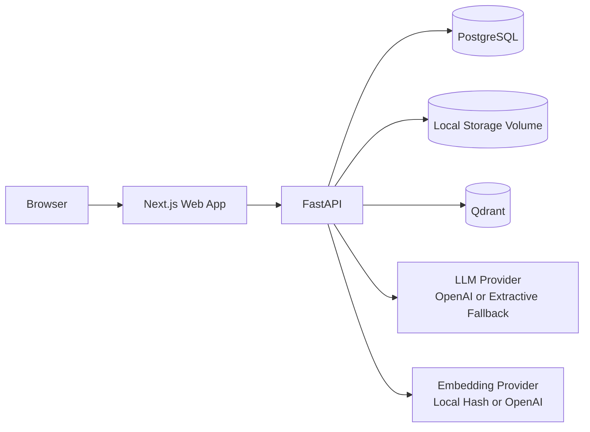
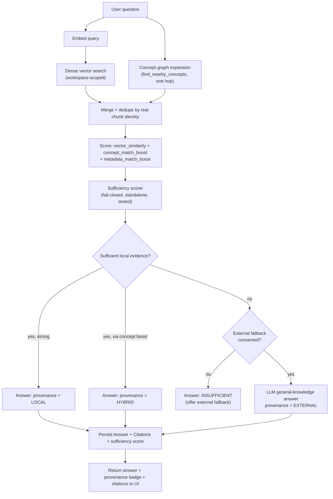

# System Architecture

> Reflects the system as of **Milestone 8** (`v0.8.0-local-first-retrieval`,
> frozen). See [`docs/adr/`](../adr/) for the individual decision records
> behind each piece below, and [`docs/milestones/`](../milestones/) for
> how it got built up incrementally.

## High-level components

Every external dependency -- storage, vector search, embeddings, LLM
generation, extraction, classification, and concept linking -- sits
behind a narrow Python interface with a swappable implementation (ADR-
0002, ADR-0004, ADR-0007, ADR-0012, ADR-0013, ADR-0014). Each ships with
a zero-config local default and an opt-in, higher-quality API-backed
implementation, so the whole stack runs with no external accounts and no
API keys out of the box.

## Ingestion flow (Milestones 3, 5, 6, 7)

```mermaid
flowchart LR
    A["POST /documents (any supported format)"] --> B[Validate type/size/checksum]
    B --> C["Save to storage, create Resource + IngestionJob"]
    C --> D[Return 201 QUEUED immediately]
    D --> E["BackgroundTask: process_resource"]
    E --> F["Extractor registry: PDF / DOCX / PPTX / TXT-MD /\ncode / YouTube transcript / image OCR"]
    F --> G{Extractable content?}
    G -- no --> H["FAILED: e.g. SCANNED_PDF_UNSUPPORTED"]
    G -- yes --> I["Chunk content (~500 tokens, overlap)"]
    I --> J[Classify: source type, subject/topic + confidence]
    J --> K[Embed chunks]
    K --> L["Upsert vectors to Qdrant\nworkspace_id + resource_id payload"]
    L --> M["Concept linking: extract/link concepts,\nstore evidence_chunk_id per link"]
    M --> N[Resource READY]
```

## Retrieval + provenance flow (Milestone 8)

## Why this shape

- **Every retrieval is workspace-scoped.** The Qdrant query filter and the
  `Resource.status == READY` check both run before any evidence reaches
  scoring, so a user can never receive an answer built from another
  workspace's resources, or from a resource that failed processing (ADR-
  0002).
- **Provenance is structural, not a courtesy.** The answer-composition
  function's return type requires a provenance label (`LOCAL` / `HYBRID`
  / `EXTERNAL`) -- it is not possible to construct an answer object
  without one (ADR-0015). Anything beyond the user's own workspace
  requires explicit, revocable consent (workspace-level or per-request).
- **The sufficiency scorer is fail-closed by construction.** Zero
  relevant local content can never be labeled Local -- this is
  independently unit-tested in isolation from the database and HTTP
  layers (`app/services/sufficiency.py`, `docs/adr/0015-retrieval-provenance.md`).
- **Citations are backend-verified, not LLM-generated.** The document,
  page, and excerpt behind every citation are read from what the backend
  actually retrieved and scored -- the model cannot invent a source.
- **Concept links carry their evidence.** Every `resource_concepts` row
  stores the exact chunk that justified it, so "why does the system
  think X relates to Y" is always answerable and auditable (ADR-0014).
- **New formats, classifiers, and concept-linking strategies are
  additive.** Extraction, classification, and concept-linking are all
  explicit plugin registries, not growing if/elif chains keyed on file
  extension -- adding a new source type never requires touching the
  retrieval or ingestion control flow (ADR-0012, ADR-0013, ADR-0014).

See [`docs/adr/`](../adr/) for the full reasoning behind each individual
decision, and [`docs/milestones/`](../milestones/) for the per-milestone
design, implementation, and verification record.
