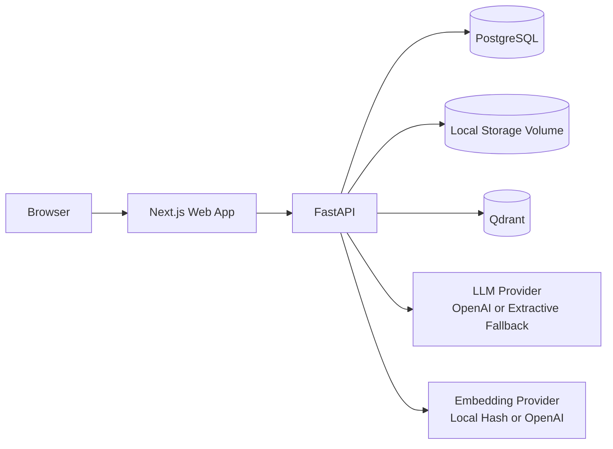
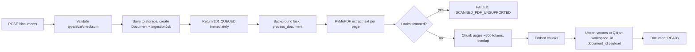
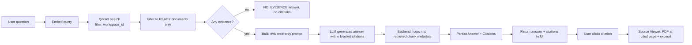

# System Architecture

## High-level components

## Ingestion flow

## RAG + citation flow

## Why this shape

- **Every retrieval is workspace-scoped.** The Qdrant query filter and the
  `Document.status == READY` check both run before evidence reaches the
  LLM, so a user can never receive an answer built from another workspace's
  documents, or from a document that failed processing (see ADR-0002).
- **Citations are backend-verified, not LLM-generated.** The model is told
  to cite with `[n]`, but the document, page, and excerpt behind each `[n]`
  are read from what the backend actually retrieved (see
  `app/services/retrieval_service.py`). The model cannot invent a source.
- **Every external dependency is behind an interface.** Storage, vector
  search, embeddings, and generation are all narrow Python interfaces with
  a swappable implementation (see ADR-0002, ADR-0004, ADR-0007). Phase 2
  and enterprise upgrades are additive, not rewrites.

See `docs/adr/` for the full reasoning behind each individual decision, and
the product freeze conversation for the frozen database schema and API
contract this implementation follows exactly.
